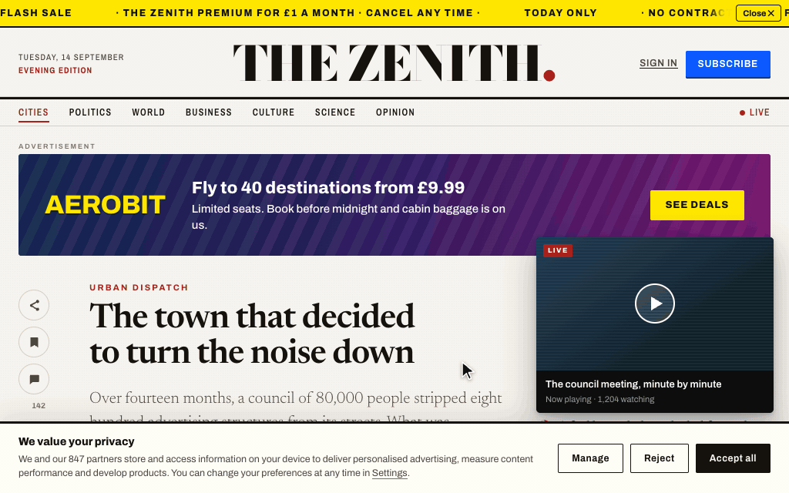
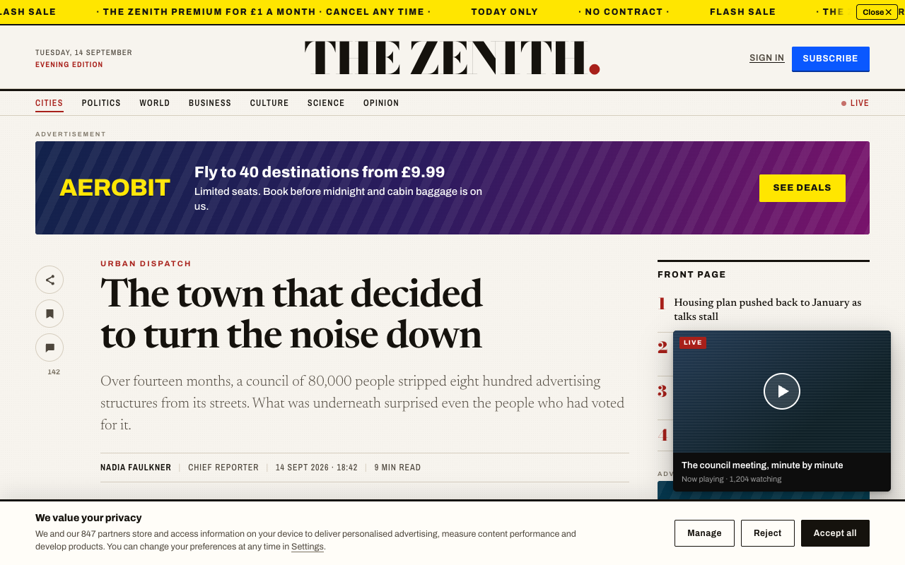
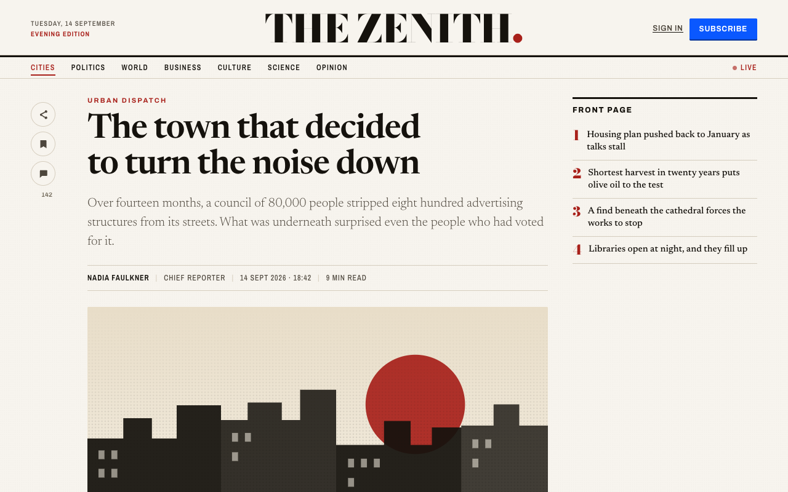
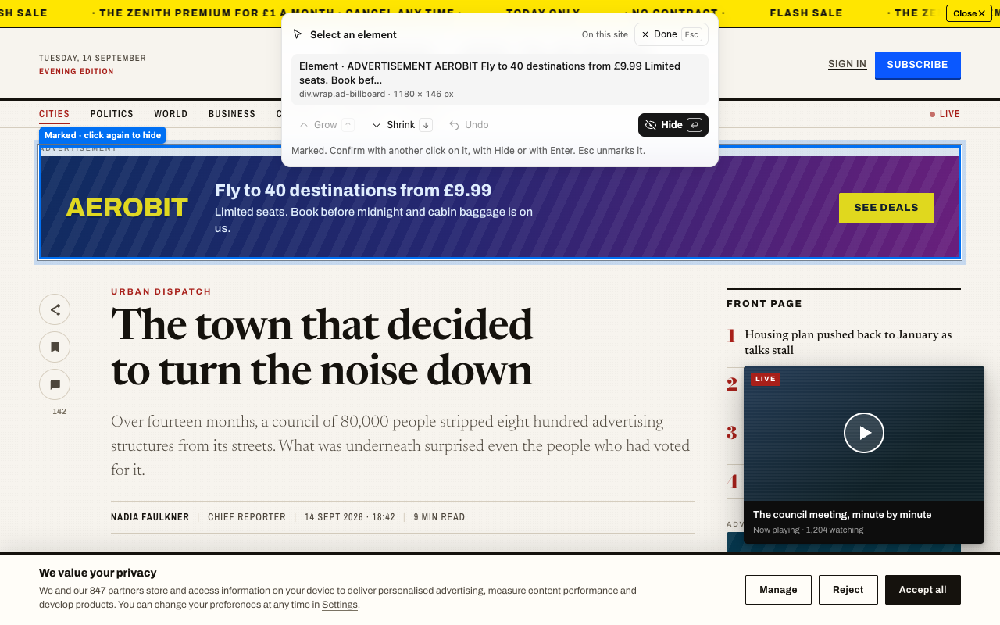
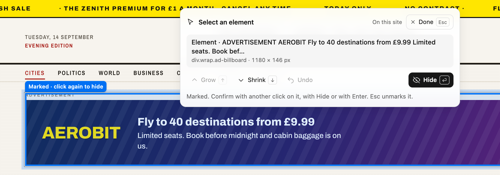
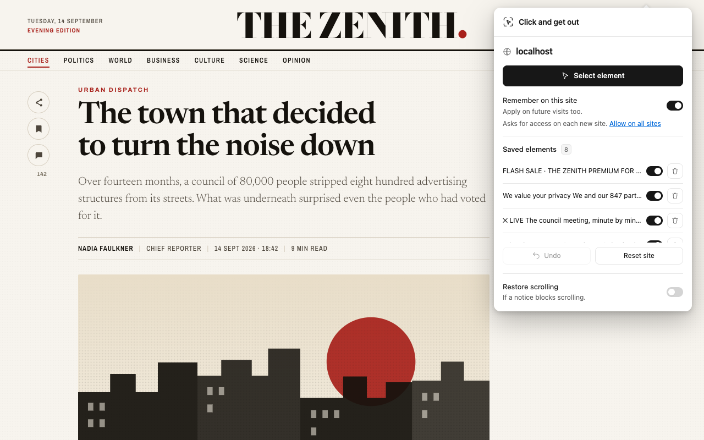
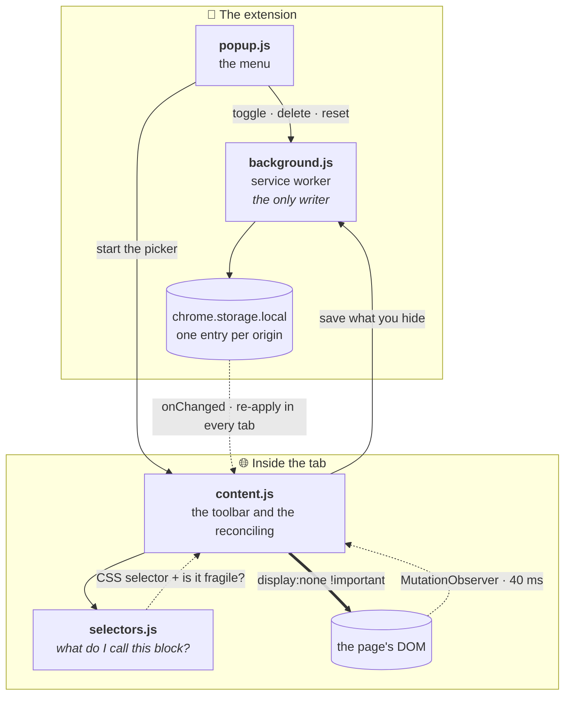

<div align="center">


# Click and get out

**Point, click and hide whatever is in the way.**
A visual picker for taking the banner, the notice or the column you did not come for off a page — and keeping it off the next time you visit.


</div>

---

<div align="center">

</div>

<sup>The whole routine: open the menu, pick, mark, grow, hide. Recorded with the real extension on the demo site included in this repo — <code>npm run clip</code> regenerates it.</sup>

<table>
<tr>
<td width="50%" align="center"><strong>Before</strong></td>
<td width="50%" align="center"><strong>After</strong></td>
</tr>
<tr>
<td></td>
<td></td>
</tr>
</table>

<sup>Both screenshots come from the demo site included in this repo, taken with the real extension. Nothing is retouched.</sup>

---

<!-- The links below are GitHub's auto-generated heading slugs. Careful with heading
     emoji: the ones that carry a variation selector (U+FE0F) — ⚙️ ↩️ 🛠️ 🖱️ and the
     like — leave an invisible character at the front of the slug and silently break
     every link that points at them. Only plain single-code-point emoji are used
     here. If you swap one, click through this list before committing. -->

## 📖 Contents

- [What it is](#-what-it-is)
- [How to use it](#-how-to-use-it)
- [The two modes](#-the-two-modes)
- [Everything is reversible](#-everything-is-reversible)
- [Languages](#-languages)
- [How it works inside](#-how-it-works-inside)
- [Privacy and permissions](#-privacy-and-permissions)
- [Scope and limits](#-scope-and-limits)
- [Install](#-install)
- [Development](#-development)
- [Demo site](#-demo-site)
- [Publishing to the Chrome Web Store](#-publishing-to-the-chrome-web-store)
- [Contributing](#-contributing)
- [Support the project](#-support-the-project)
- [License](#-license)

## 🎯 What it is

A Chrome extension that hides elements of a web page by pointing at them with the mouse. No build step, no accounts, no external services, and not a single production dependency.

It is not an ad blocker. It intercepts no downloads and keeps no filter lists: it acts on what is already on the page, when you ask it to, on the exact block you choose. That makes it useful precisely where blockers do not reach — one site's nagging notice, the "you might also like" column, the video that follows you down the article.

## 👆 How to use it



> [!NOTE]
> The interface comes in English and Spanish and follows your browser's language — see [Languages](#-languages). Control names below are the English ones.

1. Open the page, click the extension icon and choose **Select element**.
2. Point at the block. The blue frame follows the mouse and shows you **exactly** what you would hide, and the toolbar's card names it — *Link · Turn off your ad blocker* — with its HTML tag, its size in pixels, whether it floats over the page and how many images, videos and links it holds.
3. Click to **mark** it. The frame locks onto the block, gets a "Marked" tag and stops following the mouse, so you can adjust it from the toolbar: <kbd>↑</kbd> or **Grow** widens the selection to its container, <kbd>↓</kbd> or **Shrink** goes back. Clicking a different block moves the mark; <kbd>Esc</kbd> drops it.
4. Confirm with a second click on the marked block, with **Hide** in the toolbar, or with <kbd>Enter</kbd>. Keep going if you like: the toolbar lists what you remove underneath, and **Undo** takes back the last one.
5. <kbd>Esc</kbd> or **Done** to go back to browsing.



<sup>The toolbar with a block marked. The first line of the card is the block's kind and text; the second, its tag, size and contents. The amber line, when it shows, means the rule will depend on the page's structure.</sup>

| What you want | With the mouse | With the keyboard |
|---|---|---|
| Mark the block under the pointer | Click | <kbd>Enter</kbd> |
| Grow the selection to its container | **Grow** | <kbd>↑</kbd> |
| Shrink it back to the previous one | **Shrink** | <kbd>↓</kbd> |
| Hide the marked block | A second click inside the frame, or **Hide** | <kbd>Enter</kbd> |
| Drop the mark and keep pointing | Click another block | <kbd>Esc</kbd> |
| Bring back the last block you hid | **Undo** | |
| Leave the picker | **Done** | <kbd>Esc</kbd>, with nothing marked |

While the picker is running, clicks do not navigate: you can hide a link or a button without the page going anywhere. And on cards that a single "stretched" link makes clickable end to end, pointing at the photo frames the photo, not the headline.

## 🔀 The two modes

| | **This visit only** | **Remember on this site** |
|---|---|---|
| **How long it lasts** | Until you reload the tab | Until you undo it |
| **Permissions** | Nothing beyond the click | Asks for access to that site, right then |
| **Where it lives** | In memory | In your Chrome profile |

Rules are shared across pages of the same **origin** — scheme, host and port. `example.com` and `www.example.com` are different sites and do not share rules.

Because the permission is per site, every new site brings up its own prompt the first time you tick "Remember". If you would rather not see it again, the **Allow on all sites** link grants access everywhere in one go, and the same link turns into **Remove** to take it back. It is entirely optional, and the extension never asks for it on its own.

## 🔄 Everything is reversible



The menu lists what you have hidden on the site you have open, each entry with a switch and a bin:

| Control | What it does |
|---|---|
| **Switch** | Turns a rule off without deleting it. The block comes back at once, and on future visits, until you turn it on again |
| **Bin** | Deletes the rule and brings its matches back in every open tab on that origin |
| **Undo** | Reverts the last thing you hid this visit; if that had re-enabled a disabled rule, it disables it again |
| **Reset site** | Clears every rule for that origin, enabled or not, and drops the tab's temporary changes |

When a site has saved changes, the icon carries a green badge with the number of elements hidden there — or a dot, if the only thing saved is scroll recovery. With nothing active, the icon stays clean.

And if removing a notice leaves the page stuck with no scroll, **Restore scrolling** resets `overflow`, position and height on the root containers. It is a separate option, reversible, and it can be remembered too.

## 🌍 Languages

The interface ships in **English** and **Spanish**. There is no switch to flip: it goes through Chrome's own `chrome.i18n`, so it follows the language your browser is in — Spanish on a Spanish Chrome, English on any other (`default_locale` is `en`). The description on `chrome://extensions` and in the store changes with it.

What comes from the page stays as the page wrote it: the labels of the blocks you hide are their own text, in whatever language the site speaks.

| File | What it holds |
|---|---|
| `_locales/en/messages.json` | Every string in English. The reference the others are checked against |
| `_locales/es/messages.json` | The same keys, in Spanish |

**Adding a language:** copy `_locales/en/messages.json` into `_locales/<code>/`, with one of [Chrome's locale codes](https://developer.chrome.com/docs/extensions/reference/api/i18n), and translate the `message` values. Leave the keys and the `$1` placeholders as they are; counted phrases come in pairs, `linksOne` and `linksMany`. `npm test` fails if a key is missing, left over or has lost a placeholder.

## 🔧 How it works inside



### 1. Naming the block — `selectors.js`

When you point at an element, the engine looks for the shortest stable way to name it, in this order:

1. Its `#id`, if that id is **stable** and unique on the page.
2. A semantic attribute: `data-testid`, `data-test` or `aria-label`.
3. Its tag plus one to four classes, adding them until the combination is unique.
4. A special case: many sites generate class names behind a numeric namespace that **changes on every load** (`_d123456789_pp__modal`). The engine spots that pattern and grabs the semantic suffix, which does survive.
5. If none of the above pins the block down, a structural path of `:nth-of-type` steps anchored to the nearest identifiable ancestor.

"Stable" means under 100 characters and free of runs of five digits or twelve hex characters — the signature of an identifier the site regenerates on its own and that will not exist tomorrow.

Only step 5 returns `fragile: true`, and that is when the toolbar warns you that the rule depends on the page's structure.

### 2. Applying and holding — `content.js`

`reconcile()` works out which elements should be hidden and sets them to `display:none !important`. Before touching anything it **stores the original inline `display`** — value and priority — in a `Map`. When a rule stops applying, it puts exactly that value back: the extension leaves no residue on the page.

A `MutationObserver` over the whole document, with attributes filtered down to `id`, `class`, `style`, `data-testid`, `data-test` and `aria-label`, reschedules that reconciliation with a 40 ms margin. That is what keeps rules alive on sites that repaint themselves, load content as you scroll, or put back the block you just removed.

The picker's toolbar lives in a `<div data-click-and-get-out-ui>` with `all:initial !important` and a **shadow root** of its own, at maximum `z-index`. The page's CSS cannot get in and the extension's cannot get out. Pointer and click events are taken in the capture phase with `preventDefault` and `stopImmediatePropagation`, which is why you can hide a link without navigating to it. Picking is a two-step gesture: the first click only marks the block and freezes the frame, so the pointer can travel to the toolbar; a second click inside the frame, **Hide** or <kbd>Enter</kbd> is what actually hides it. The card under the title describes whatever is framed: its kind and text on the first line, and underneath its tag with id and classes, its size, *Floating* when it is `fixed` or `sticky`, and a count of the images, videos and links inside; hovering the card shows the CSS selector the rule would use.

One more thing the picker corrects: many sites make a whole card clickable with a "stretched link", an `::after` on the headline's `<a>` that covers the card. Pseudo-elements cannot receive events, so pointing at the photo makes the browser report the headline link — whose box does not even contain the pointer. When that happens the picker takes the first real element under the pointer instead, so the photo, the caption or the card itself get framed, not the headline.

### 3. Saving — `background.js`

The service worker is **the only writer**. Every message goes through one chained promise, so two tabs writing at once cannot trample each other's read-modify-write cycle.

It registers the content script **per origin** with `persistAcrossSessions`, so on your next visit it already runs at `document_start`: the block never gets a chance to flash before it disappears. If you withdraw a site's permission from Chrome, `permissions.onRemoved` unregisters the scripts that no longer have access.

It also paints the icon's badge. It only reads `tab.url` on sites that have already granted access, which is exactly where rules can exist — which is why the badge needs no `tabs` permission.

### Data model

One entry per origin, capped at 200 rules per site:

```jsonc
"site:https://example.com": {
  "rules": [
    {
      "id": "8f3e...",              // crypto.randomUUID()
      "selector": "#cookie-wall",   // whatever selectors.js returned
      "label": "We value your privacy…",
      "fragile": false,             // true for a structural path
      "enabled": true,              // the switch in the menu
      "createdAt": 1757808000000
    }
  ],
  "unlockScroll": false
}
```

## 🔒 Privacy and permissions

**There are no network requests. None.** No analytics, no accounts, no telemetry, no remote code. What you save never leaves your Chrome profile and is not synced to any account.

| Permission | What for |
|---|---|
| `activeTab` | Temporary access to the tab, only when you click the icon |
| `scripting` | Injecting the picker and applying your rules |
| `storage` | Keeping the rules locally |
| `http`/`https` *(optional)* | Only for the sites where you choose to remember changes — or for all of them at once via **Allow on all sites** |

A rule holds a CSS selector and a short label taken from the block you picked. **Reset site** clears the ones for that origin; the permission is withdrawn from **Details → Site access**; uninstalling wipes all local storage.

Reference: [Chrome permissions](https://developer.chrome.com/docs/extensions/develop/concepts/declare-permissions) and [content scripts](https://developer.chrome.com/docs/extensions/develop/concepts/content-scripts).

## 🚧 Scope and limits

Worth knowing what it does **not** do:

- **It is not an ad blocker.** It hides what is already on the page. It stops no downloads, defeats no ad-block detection, and cannot recover content the site never delivered.
- **Rules can go stale.** If a site redesigns, a rule may stop working or start catching a different block. Switch it off or delete it and pick again.
- **Main document only.** It does not reach inside iframes or Shadow DOM, though you can select their outer container.
- **Out of reach:** native top-layer dialogs, the PDF viewer, the Chrome Web Store and the browser's internal pages.
- Some sites may interfere with the picker or re-block navigation from JavaScript.

## 📦 Install

1. Get the code: clone the repo, or use **Code → Download ZIP** on GitHub and unzip it.

   ```sh
   git clone https://github.com/gatsbys/click-and-get-out.git
   ```

2. Open `chrome://extensions`.
3. Turn on **Developer mode**, top right.
4. **Load unpacked** → pick the folder you just got, the one with `manifest.json` in it.
5. Pin it from the extensions button (the puzzle piece).

If what you have is a `click-and-get-out.zip` build, unzip it first and load the extracted folder. Either way, keep that folder where it is: Chrome reads the files from there. Nothing needs Node, or any install at all, to *use* the extension.

**Updating:** replace the files in the same folder — `git pull`, if you cloned — and hit **Reload** on its card in `chrome://extensions`. Keeping the path keeps the extension's id, and with it your saved rules.

## 💻 Development

Node 22 or newer for the tooling. Zero production dependencies; Playwright only for the tests.

```sh
npm ci
npx playwright install chromium

npm run check   # syntax of the four scripts
npm test        # the full suite
npm run pack    # the three builds in dist/
npm run demo    # the demo site
npm run try     # a Chromium window with the extension loaded over the demo
npm run shots   # the store screenshots
npm run clip    # the usage GIF at the top of this page
```

`npm run try` is the quickest way to poke at a change by hand: it opens Playwright's Chromium with the extension loaded and the demo site in front, without touching your own Chrome. It comes up in English; `npm run try es` brings it up in Spanish, whatever language your system is in. No permission is granted up front, so **Remember on this site** raises Chrome's real prompt, and the profile is kept in `dist/try/`, so what you save is still there next time.

`npm run pack` needs the `zip` utility and produces three outputs from the same files:

| Output | What for |
|---|---|
| `dist/click-and-get-out/` | Folder ready for **Load unpacked**. The handiest one to iterate on: load it once, then just **Reload** |
| `dist/click-and-get-out.zip` | For installing by hand, without the repo |
| `dist/click-and-get-out-store.zip` | **The store one**, with `manifest.json` at the archive root |

`npm test` reports 22 passing. Two are static: an audit of `manifest.json` — Manifest V3, no mandatory host access, no declared content scripts — and a check that every language under `_locales/` carries exactly the same messages, with the same placeholders, and that every key the code asks for exists.

Then come eighteen scenarios, under one parent test, that drive the real extension in Chromium with a throwaway profile and a local page, with the interface pinned to Spanish. They cover container selection, marking with one click and confirming with the next, clicking without navigating, cards covered by a stretched link, `!important` styles, reload, reinsertion, concurrent writes, per-origin isolation, scroll recovery, the menu controls, disabling and deleting rules, and the toolbar's card and list. Also both themes, keyboard control, popup sizing, long lists, errors and narrow windows, leaving screenshots in `test-results/`. A last test loads the extension again in English and reads the menu, the toolbar, the service worker's errors and the badge.

Two things are left for a manual pass, because the native permission dialog cannot be automated: granting and denying a site's permission, and the real `activeTab` activation from Chrome's toolbar.

## 📰 Demo site

```sh
npm run demo   # http://localhost:4173
```

It serves **EL CENIT**, a fictional newspaper deliberately buried in clutter: a subscription bar, a cookie wall, a floating video, a header billboard, a sidebar ad, an app banner, a sponsored grid, a "most read" list and a floating share rail. Nine blocks, so the picker has something to take away. `/en.html` is the same edition in English, **THE ZENITH**.

Neither the paper, nor the brands, nor the people in it exist.

| Parameter | Effect |
|---|---|
| `?modal=1` | Opens the notice that blocks scrolling, to try **Restore scrolling** |
| `?clean=1` | Hides the clutter without the extension, for a side-by-side comparison |

`npm run shots` loads the real extension over that demo and writes the four 1280×800 images the store asks for into `store/screenshots/es/` and `store/screenshots/en/` — each set with the newspaper's edition and the extension's interface in the same language — plus the 2× close-up of the toolbar shown above, in `docs/images/`. It doubles as a check: the header billboard has to reach a selection that does not depend on page structure, or the script fails rather than produce a bad screenshot. Each of the eight blocks it hides is reported too, with the selector it resolved to and whether that selector is structural.

`npm run clip` records the GIF at the top of this page the same way, and needs `ffmpeg`. It does not capture the screen in real time: it moves the mouse a step, lets the extension repaint, takes a frame and goes again, so the result is identical on any machine. The pointer and the menu are drawn on top, because a page capture includes neither; every frame, click and block hidden underneath is the extension at work. It writes `docs/images/demo.gif` and a lighter `dist/demo.mp4`; `npm run clip es` does the Spanish edition.

## 🚀 Publishing to the Chrome Web Store

This is the maintainer's checklist. Under the [license](#-license), nobody else may publish the extension, on this store or any other.

| File | Contents |
|---|---|
| `store/LISTING.en.md` | Listing copy: title, descriptions, single purpose and a justification for each permission |
| `store/PRIVACY.en.md` | Privacy policy, to publish at a public URL and link from the listing |
| `store/LISTING.md` · `store/PRIVACY.md` | Their Spanish counterparts |
| `store/screenshots/` | The 1280×800 images, per language |

The package is localised, so one upload serves both listings: the title and the summary come from `_locales/`, and the dashboard's **Store listing** tab offers a language selector for the detailed description and the screenshots.

Upload `dist/click-and-get-out-store.zip`, not the other one: the store rejects a ZIP whose `manifest.json` is not at the root.

## 🤝 Contributing

Issues and pull requests are welcome.

- **A block will not hide, or keeps coming back?** [Open an issue](https://github.com/gatsbys/click-and-get-out/issues) with the page's URL, the block you pointed at and your Chrome version. If the toolbar showed the amber structure warning, say so.
- **Sending a pull request?** Run `npm run check` and `npm test` first; both have to pass. There is no build step, so what you edit is what Chrome loads.
- Two lines the project does not cross: no production dependencies and no network requests.

> [!IMPORTANT]
> The [license](#-license) does not allow changing the code, so pull requests need an explicit exception, and this is it: you may fork this repository and modify the code **for the sole purpose of proposing those changes back here as a pull request**. By opening one, you agree that your contribution becomes part of the project under its license, and you grant the copyright holder a perpetual, worldwide, irrevocable, royalty-free right to use, modify, distribute and relicense it.

## ☕ Support the project

If it has saved you some aggravation, you can buy me a coffee:

<a href="https://www.buymeacoffee.com/the.gatsbys" target="_blank"></a>

## 📄 License

**Source-available, not open source.** The code is here to be read, audited and used, under the [PolyForm Strict License 1.0.0](LICENSE):

- **You can** install it and use it, free of charge, for any personal or otherwise noncommercial purpose — and read every line to check that it does what it says.
- **You cannot** distribute it, changed or unchanged — which includes uploading it to the Chrome Web Store or any other store, under this name or another — nor use it commercially, sell it, or make changes or new works based on it. The one exception is the one in [Contributing](#-contributing), which is what makes pull requests possible.

That is a summary for convenience; the [license text](LICENSE) is what governs. For anything it does not cover, [open an issue](https://github.com/gatsbys/click-and-get-out/issues).

Copyright © 2026 Cristian de Murcia.

---

<div align="center">
<sub>Built on the idea that a web page should show you what you came to read.</sub>
</div>
