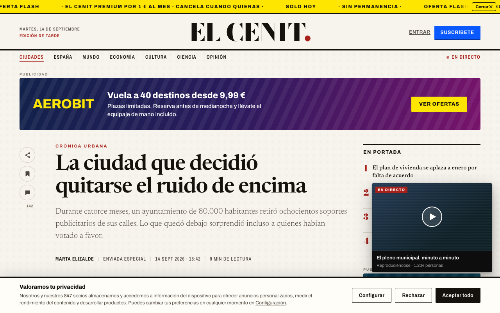
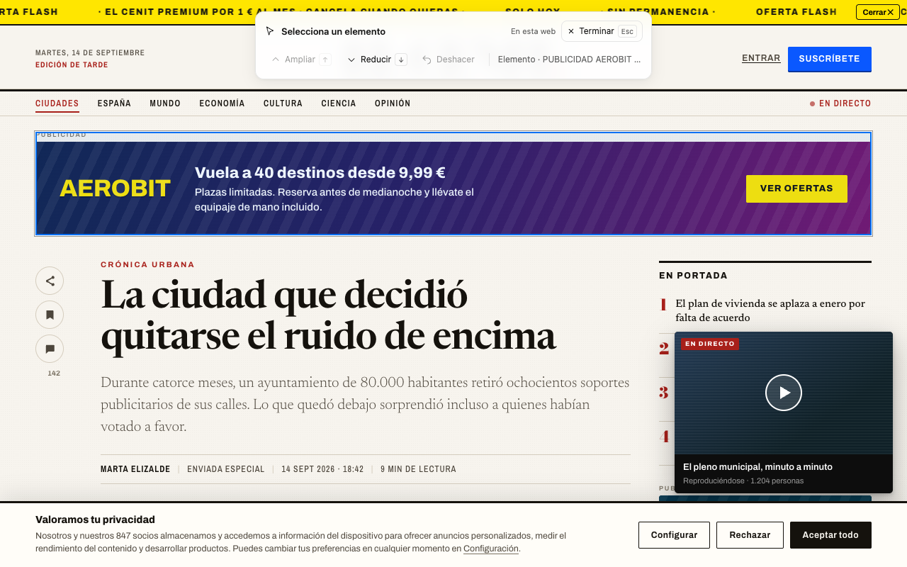
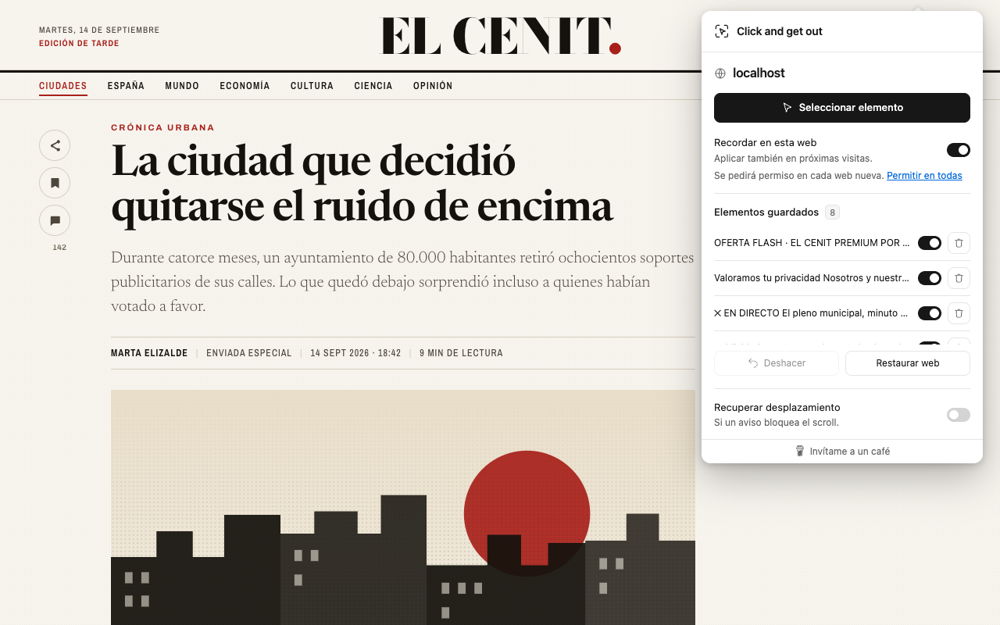
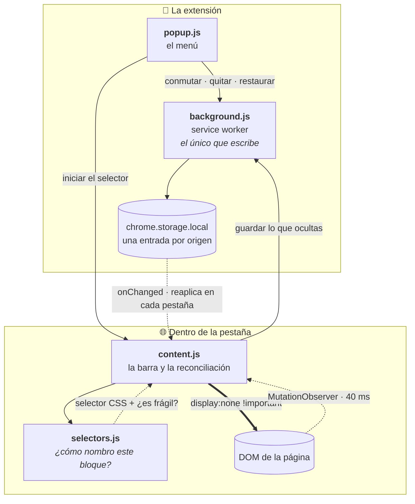

<div align="center">


# Click and get out

**Señala, haz clic y oculta lo que sobra.**
Un selector visual para quitar de una web el banner, el aviso o la columna que te estorba — y que siga fuera la próxima vez que vuelvas.


</div>

---

<table>
<tr>
<td width="50%" align="center"><strong>Antes</strong></td>
<td width="50%" align="center"><strong>Después</strong></td>
</tr>
<tr>
<td></td>
<td></td>
</tr>
</table>

<sup>Las dos capturas son de la web de demostración incluida en el repo, generadas con la extensión real. No hay retoque.</sup>

---

## 📖 Índice

- [Qué es](#-qué-es)
- [Cómo se usa](#-cómo-se-usa)
- [Los dos modos](#-los-dos-modos)
- [Todo es reversible](#-todo-es-reversible)
- [Cómo funciona por dentro](#-cómo-funciona-por-dentro)
- [Privacidad y permisos](#-privacidad-y-permisos)
- [Alcance y límites](#-alcance-y-límites)
- [Instalar](#-instalar)
- [Desarrollo](#-desarrollo)
- [Web de demostración](#-web-de-demostración)
- [Publicación en Chrome Web Store](#-publicación-en-chrome-web-store)
- [Apoya el proyecto](#-apoya-el-proyecto)

## 🎯 Qué es

Una extensión de Chrome que oculta elementos de una página web señalándolos con el ratón. Sin compilación, sin cuentas, sin servicios externos y sin una sola dependencia en producción.

No es un bloqueador de anuncios. No intercepta descargas ni mantiene listas de filtros: actúa sobre lo que ya está en la página, cuando tú se lo pides y sobre el bloque exacto que tú eliges. Eso la hace útil justo donde los bloqueadores no llegan — el aviso de una web concreta, la columna de "te puede interesar", el vídeo que te persigue mientras lees.

## 🖱️ Cómo se usa



1. Abre la web, pulsa el icono de la extensión y elige **Seleccionar elemento**.
2. Señala el bloque. El marco azul muestra **exactamente** qué vas a ocultar antes de confirmar.
3. Si solo se marca el texto, pulsa <kbd>↑</kbd> para ampliar la selección al contenedor. <kbd>↓</kbd> vuelve a la anterior. También hay botones en la barra.
4. Haz clic o pulsa <kbd>Enter</kbd> para ocultar. Puedes seguir quitando bloques: la barra los va listando debajo y **Deshacer** retira el último.
5. <kbd>Esc</kbd> o **Terminar** para volver a navegar normalmente.

Mientras el selector está activo, los clics no navegan: puedes ocultar un enlace o un botón sin que la página se te vaya.

## 🔀 Los dos modos

| | Solo esta visita | Recordar en esta web |
|---|---|---|
| **Cuánto dura** | Hasta que recargues la pestaña | Para siempre, hasta que lo deshagas |
| **Permisos** | Ninguno extra | Pide acceso a ese sitio, en ese momento |
| **Dónde se guarda** | En memoria | En tu perfil de Chrome |

Las reglas se comparten entre páginas del mismo **origen** (protocolo, host y puerto). `ejemplo.com` y `www.ejemplo.com` son sitios distintos y no comparten reglas.

Como el permiso es por sitio, cada web nueva estrena su propio diálogo la primera vez que marcas «Recordar». Si prefieres no volver a verlo, el enlace **Permitir en todas** concede el acceso una sola vez para cualquier web; el mismo enlace pasa a **Quitar** para retirarlo. Es opcional y la extensión nunca lo pide por su cuenta.

## ↩️ Todo es reversible



El menú lista lo que has ocultado en la web que tengas abierta, cada elemento con un interruptor y una papelera:

| Control | Qué hace |
|---|---|
| **Interruptor** | Desactiva la regla sin borrarla. El bloque vuelve a verse al momento y en próximas visitas, hasta que lo actives de nuevo |
| **Papelera** | Elimina la regla y muestra sus coincidencias en las pestañas abiertas de ese origen |
| **Deshacer** | Revierte la última ocultación de esa visita; si reactivó una regla desactivada, la vuelve a desactivar |
| **Restaurar web** | Borra todas las reglas de ese origen, activas y desactivadas, y limpia los cambios temporales de la pestaña |

Cuando una web tiene cambios guardados, el icono lleva una marca verde con el número de elementos ocultos. Si no hay nada activo, el icono queda limpio.

Y si al quitar un aviso la página se queda sin scroll, **Recuperar desplazamiento** ajusta el `overflow`, la posición y la altura de los contenedores raíz. Es una opción aparte, reversible, y también puede recordarse.

## ⚙️ Cómo funciona por dentro



### 1. Identificar el bloque — `selectors.js`

Cuando señalas un elemento, el motor busca la forma más corta y estable de nombrarlo, en este orden:

1. Su `#id`, si es **estable** y único en la página.
2. Un atributo semántico: `data-testid`, `data-test` o `aria-label`.
3. Su etiqueta más una a cuatro clases, añadiéndolas hasta que la combinación sea única.
4. Un caso especial: muchas webs generan clases con un prefijo numérico que **cambia en cada carga** (`_d123456789_pp__modal`). El motor detecta ese patrón y se agarra al sufijo semántico, que sí se mantiene.
5. Si nada de lo anterior identifica el bloque, una ruta estructural con `:nth-of-type` anclada al ancestro identificable más cercano.

«Estable» significa menos de 100 caracteres y sin rachas de cinco dígitos o doce hexadecimales seguidos — la firma de un identificador que la web regenera sola y que mañana ya no existirá.

Solo el paso 5 devuelve `fragile: true`, y entonces la barra te avisa de que esa regla depende de la estructura de la página.

### 2. Aplicar y mantener — `content.js`

`reconcile()` calcula qué elementos deben estar ocultos y los pone en `display:none !important`. Antes de tocar nada **guarda el `display` en línea original**, valor y prioridad, en un `Map`. Cuando una regla deja de aplicarse, restaura exactamente ese valor: la extensión no deja residuo en la página.

Un `MutationObserver` sobre todo el documento, con los atributos filtrados a `id`, `class`, `style`, `data-testid`, `data-test` y `aria-label`, reprograma esa reconciliación con 40 ms de margen. Eso es lo que hace que las reglas aguanten en webs que repintan solas, cargan contenido al hacer scroll o vuelven a insertar el bloque que acabas de quitar.

La barra del selector vive en un `<div data-click-and-get-out-ui>` con `all:initial !important` y un **shadow root** propio, a `z-index` máximo. El CSS de la página no puede entrar y el de la extensión no puede salir. Los eventos de puntero y clic se capturan en fase de captura con `preventDefault` y `stopImmediatePropagation`, que es por lo que puedes ocultar un enlace sin navegar a él.

### 3. Guardar — `background.js`

El service worker es **el único que escribe**. Cada mensaje pasa por una promesa encadenada, así que dos pestañas escribiendo a la vez no pueden pisarse el ciclo leer-modificar-escribir.

Registra el content script **por origen** con `persistAcrossSessions`, de modo que en la siguiente visita se ejecuta ya en `document_start`: el bloque no llega a verse antes de desaparecer. Si retiras el permiso de un sitio desde Chrome, `permissions.onRemoved` da de baja los scripts que ya no tienen acceso.

También pinta la marca del icono. Solo lee `tab.url` en los sitios donde ya hay acceso concedido, que es justo donde puede haber reglas — por eso la marca no necesita el permiso `tabs`.

### Modelo de datos

Una entrada por origen, con un máximo de 200 reglas por web:

```jsonc
"site:https://ejemplo.com": {
  "rules": [
    {
      "id": "8f3e...",              // crypto.randomUUID()
      "selector": "#cookie-wall",   // lo que devolvió selectors.js
      "label": "Valoramos tu privacidad…",
      "fragile": false,             // true si es una ruta estructural
      "enabled": true,              // el interruptor del menú
      "createdAt": 1757808000000
    }
  ],
  "unlockScroll": false
}
```

## 🔒 Privacidad y permisos

**No hay peticiones de red. Ninguna.** Ni analítica, ni cuentas, ni telemetría, ni código remoto. Lo que guardas no sale de tu perfil de Chrome y no se sincroniza con ninguna cuenta.

| Permiso | Para qué |
|---|---|
| `activeTab` | Acceso temporal a la pestaña, solo al pulsar el icono |
| `scripting` | Insertar el selector y aplicar tus reglas |
| `storage` | Guardar las reglas localmente |
| `http/https` *(opcional)* | Solo para los sitios donde eliges recordar cambios, o para todos a la vez si usas **Permitir en todas** |

Las reglas contienen un selector CSS y una etiqueta breve tomada del bloque elegido. **Restaurar web** limpia las de ese origen; el permiso se retira desde **Detalles → Acceso al sitio**; desinstalar borra todo el almacenamiento local.

Referencia: [permisos de Chrome](https://developer.chrome.com/docs/extensions/develop/concepts/declare-permissions) y [content scripts](https://developer.chrome.com/docs/extensions/develop/concepts/content-scripts).

## 🚧 Alcance y límites

Conviene saber qué **no** hace:

- **No es un bloqueador de anuncios.** Oculta lo que ya está en la página. No detiene descargas, no desactiva la detección de bloqueadores y no recupera contenido que la web no haya entregado.
- **Las reglas pueden caducar.** Si la web rediseña, una regla puede dejar de servir o afectar a un bloque distinto. Desactívala o elimínala y vuelve a seleccionar.
- **Solo el documento principal.** No entra dentro de iframes ni de Shadow DOM, aunque sí puedes seleccionar su contenedor externo.
- **Zonas fuera de alcance:** diálogos nativos en la capa superior, el visor de PDF, la Chrome Web Store y las páginas internas del navegador.
- Algunas webs pueden interferir con el selector o volver a bloquear la navegación por JavaScript.

## 📦 Instalar

1. Abre `chrome://extensions`.
2. Activa **Modo de desarrollador**, arriba a la derecha.
3. **Cargar descomprimida** → selecciona esta carpeta, la que contiene `manifest.json`.
4. Fíjala desde el botón de extensiones (la pieza de puzle).

Si recibes `dist/click-and-get-out.zip`, descomprímelo primero y carga la carpeta extraída. Consérvala: Chrome lee los archivos desde ahí. No hace falta Node ni instalar nada para *usar* la extensión.

**Actualizar:** sustituye los archivos en la misma carpeta y pulsa **Recargar** en su tarjeta de `chrome://extensions`. Mantener la ruta conserva el identificador de la extensión y tus reglas guardadas.

## 🛠️ Desarrollo

Node 22 o posterior para las herramientas. Cero dependencias en producción; Playwright solo para las pruebas.

```sh
npm ci
npx playwright install chromium

npm run check   # sintaxis de los cuatro scripts
npm test        # 18 pruebas en Chromium real
npm run pack    # los tres paquetes de dist/
npm run demo    # la web de demostración
npm run shots   # las capturas de la ficha
```

`npm run pack` necesita la utilidad `zip` y genera tres salidas con los mismos archivos:

| Salida | Para qué |
|---|---|
| `dist/click-and-get-out/` | Carpeta lista para **Cargar descomprimida**. La más cómoda para iterar: cárgala una vez y luego basta **Recargar** |
| `dist/click-and-get-out.zip` | Para compartir e instalar a mano |
| `dist/click-and-get-out-store.zip` | **El de la tienda**, con `manifest.json` en la raíz del archivo |

Las pruebas cargan la extensión en Chromium real con un perfil temporal y una página local. Cubren selección de contenedor, clic sin navegación, estilos `!important`, recarga, reinserción, escrituras simultáneas, aislamiento por origen, recuperación del scroll, controles del menú, desactivación y borrado de reglas, y la lista de la barra flotante. También ambos temas, teclado, tamaño del menú, listas largas, errores y ventanas estrechas, dejando capturas en `test-results/`.

Quedan dos cosas para comprobación manual, porque el diálogo nativo de permisos no se puede automatizar: conceder y denegar el permiso de un sitio, y la activación real de `activeTab` desde la barra de Chrome.

## 📰 Web de demostración

```sh
npm run demo   # http://localhost:4173
```

Sirve **EL CENIT**, un periódico ficticio saturado a propósito: barra de suscripción, muro de cookies, vídeo flotante, anuncio de cabecera, faldón lateral, banner de app, contenido patrocinado y "lo más leído". Nueve bloques para que el selector tenga algo que quitar. `/en.html` es la misma edición en inglés, **THE ZENITH**.

Ni el medio, ni las marcas, ni las personas que aparecen existen.

| Parámetro | Efecto |
|---|---|
| `?modal=1` | Abre el aviso que bloquea el scroll, para probar **Recuperar desplazamiento** |
| `?clean=1` | Esconde el ruido sin la extensión, para comparar de un vistazo |

`npm run shots` carga la extensión real sobre esa demo y genera en `store/screenshots/es/` y `store/screenshots/en/` las cuatro imágenes a 1280×800 que pide la tienda. De paso hace de prueba: si alguno de los nueve bloques pasa a necesitar una ruta estructural, el script falla en vez de sacar una captura mala.

## 🚀 Publicación en Chrome Web Store

| Archivo | Contenido |
|---|---|
| `store/LISTING.md` | Textos de la ficha: título, descripciones, propósito único y justificación de cada permiso |
| `store/PRIVACY.md` | Política de privacidad, para publicar en una URL pública y enlazarla desde la ficha |
| `store/LISTING.en.md` · `store/PRIVACY.en.md` | Sus equivalentes en inglés |
| `store/screenshots/` | Las capturas a 1280×800, por idioma |

Sube `dist/click-and-get-out-store.zip`, no el otro: la tienda rechaza un ZIP cuyo `manifest.json` no esté en la raíz.

## ☕ Apoya el proyecto

Si te ha ahorrado algún disgusto, puedes invitarme a un café:

<a href="https://www.buymeacoffee.com/the.gatsbys" target="_blank"></a>

---

<div align="center">
<sub>Hecho con la idea de que una web debería enseñarte lo que fuiste a leer.</sub>
</div>
